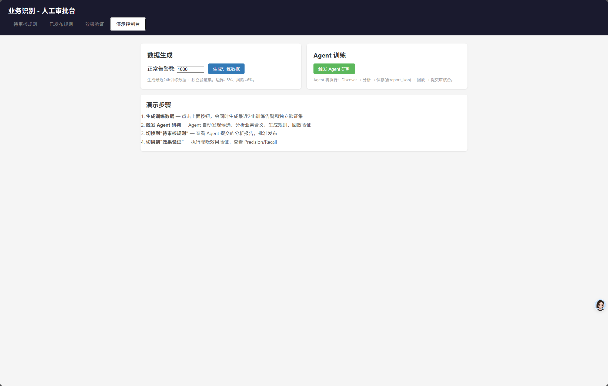
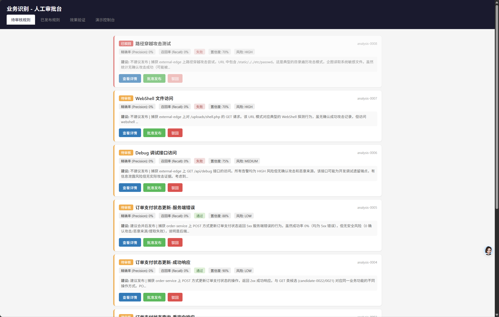
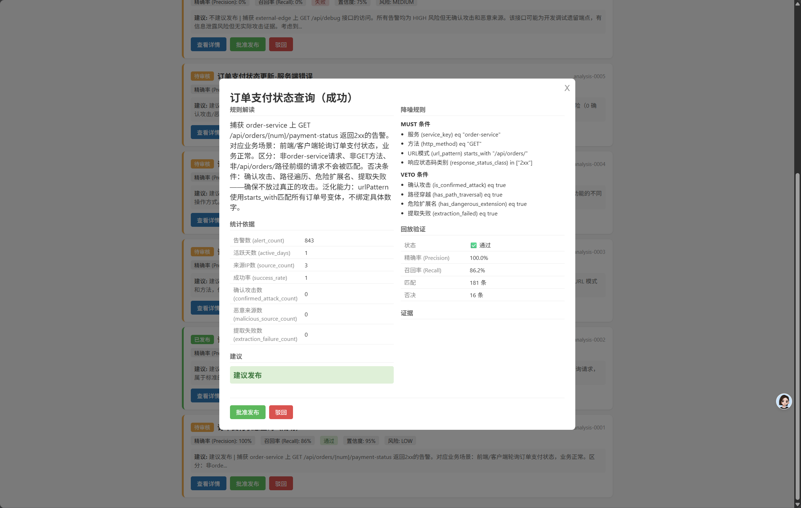
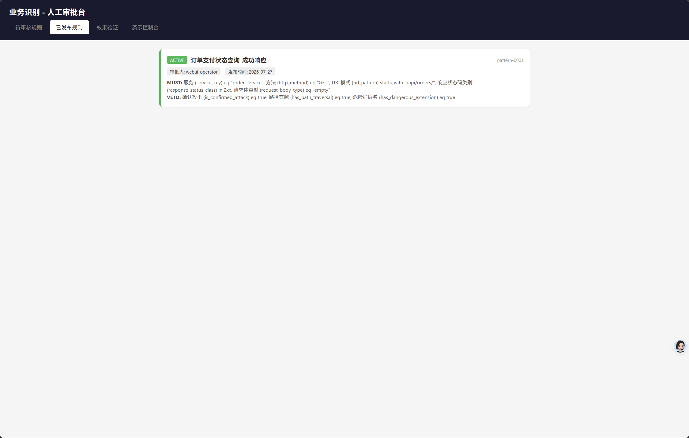
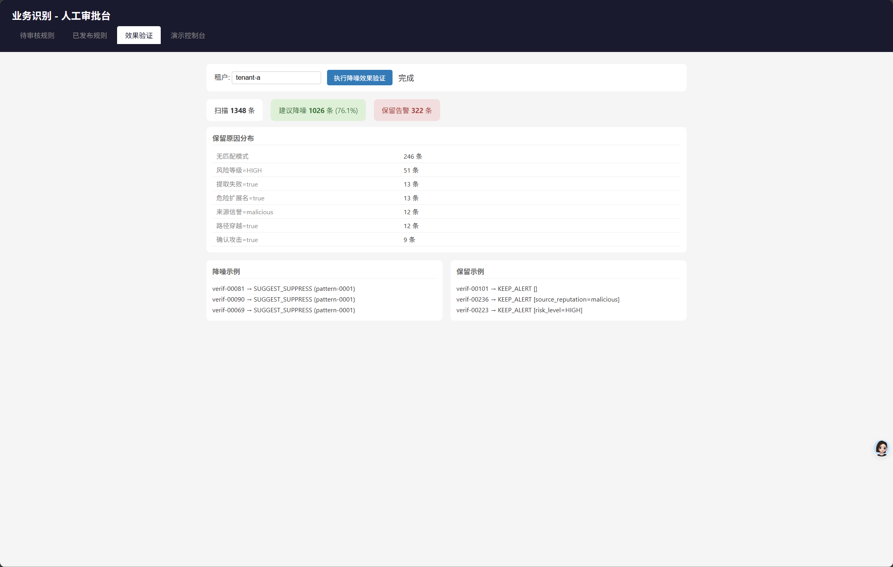
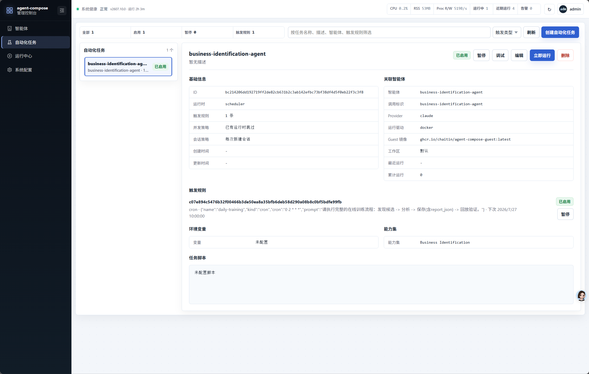
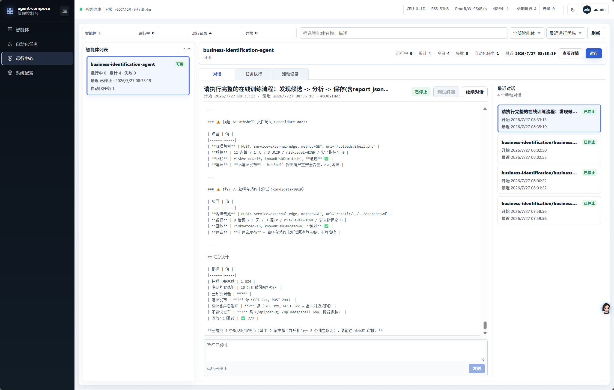

# 业务识别告警降噪系统

> **演示文档** | 请将截图替换到对应的 `[screenshot]` 占位处

---

## 1. 项目背景

### 1.1 痛点

> **[screenshot: 海量告警截图 — 展示告警列表/仪表盘，突出数量大、重复多]**

- WAF/SIEM 每日产生海量告警，安全运营人员疲于应对
- 大量告警实际上是合法的业务行为，但缺乏自动识别手段
- 人工研判效率低，漏报与误报难以平衡

### 1.2 目标

> **[screenshot: 核心目标 — 可以是架构图或目标示意图]**

将「安全运营人员从告警堆中识别可降噪的业务模式」这一过程，交给 Agent 自动完成。

---

## 2. 系统架构

### 2.1 整体架构

> **[screenshot: 系统架构图 — 展示 OctoBus / agent-compose / WebUI 三者关系]**

```
┌──────────────┐     ┌──────────────┐     ┌──────────────┐
│   OctoBus    │     │agent-compose │     │  DeepSeek V4 │
│  (能力网关)   │←───→│ (Agent 平台)  │←───→│  (LLM 模型)   │
└──────┬───────┘     └──────────────┘     └──────────────┘
       │
  ┌────┴────┐
  │ Web UI  │  ← 人工审批台 + 演示控制台 (:3456)
  └─────────┘
```

### 2.2 核心设计原则

> **[screenshot: 设计原则示意图]**

| 原则 | 说明 |
|------|------|
| LLM 做理解 | 业务含义理解、must/veto 条件制定、中文报告生成 |
| 代码做判断 | 告警画像归一化、分组聚类、系统否决规则、条件评估 |
| 人做决策 | 最终审批权在安全运营人员手中 |

---

## 3. 核心流程

### 3.1 训练 Pipeline

> **[screenshot: 完整流程图 — 展示 发现→分析→回放→审核 全链路]**

```
Discover → Analyze → Replay → Review → Publish
  发现       分析      回放     审核      发布
```

1. **Discover** — 从海量告警中聚类发现候选业务模式
2. **Analyze** — LLM 分析候选模式，生成业务解释和 must/veto 条件
3. **Replay** — 在独立验证集上回放，验证规则质量（精确率/召回率）
4. **Review** — 人工审核分析报告，批准或驳回
5. **Publish** — 规则发布生效，后续同类告警自动降噪

### 3.2 判定链路

> **[screenshot: 判定链路详解 — 展示 must 条件 / veto 条件 / 系统否决的协作关系]**

每条规则包含：
- **must 条件** — 必须全部满足才能命中
- **veto 条件** — 任一命中则否决（即使 must 全部满足）
- **系统否决** — 6 条硬编码的安全底线，绕过所有规则，始终告警

---

## 4. WebUI 演示

### 4.1 演示控制台



- 一键生成模拟训练数据
- 手动触发 Agent 执行完整研判流程

### 4.2 待审核规则



- Agent 自动生成的分析报告
- 包含：业务解释、证据摘要、must/veto 条件、Replay 验证结果

### 4.3 规则详情与审批



- 业务解释（中文自然语言）
- must 条件列表（字段 + 操作符 + 阈值）
- veto 条件列表
- Replay 统计（精确率 / 召回率 / F1）

### 4.4 已发布规则



- 展示所有已审批发布的规则
- 规则生效状态

### 4.5 效果验证



- 降噪前告警量 vs 降噪后告警量
- 降噪率统计
- 误杀率统计

---

## 5. 定时任务

### 5.1 任务配置



`agent-compose.yml` 内置 scheduler，定义 Agent 的系统提示词和定时触发规则。Agent 按 schedule 周期执行完整训练 pipeline：Discover → Analyze → Replay → Submit for Review。

### 5.2 运行效果



每天凌晨 2:00 自动触发，Agent 在独立 Docker 沙箱中执行，完成后自动销毁。运行日志可追踪每一步的耗时和结果，3 条候选规则在约 2 分钟内完成分析并提交审核。

---

## 6. 安全设计

> **[screenshot: 安全架构图 — OctoBus 鉴权 / capproxy / 沙箱隔离]**

| 层面 | 措施 |
|------|------|
| Agent 隔离 | Docker 沙箱，Agent 无法访问宿主 |
| 接口鉴权 | OctoBus Bearer Token + 能力集方法级控制 |
| 操作审计 | 所有调用全量记录 |
| 系统否决 | 6 条硬编码规则，LLM 不可覆盖 |

---

## 7. 总结

> **[screenshot: 总结页 / 关键指标]**

- **自动化** — Agent 自主完成「发现→分析→回放→提交审核」全流程
- **可解释** — 每条规则附带 LLM 生成的中文业务解释
- **可验证** — 独立验证集回放，量化规则质量
- **人机协同** — LLM 提供建议，人做最终决策

---

## 附录

### 技术栈

| 组件 | 技术 |
|------|------|
| Service 运行时 | Node.js 22 |
| 数据存储 | sql.js (SQLite WASM) |
| Agent 平台 | agent-compose |
| LLM | DeepSeek V4 |
| WebUI | Express.js + 原生 HTML/CSS/JS |
| 容器化 | Docker Compose |

### 快速启动

```bash
docker compose up -d
# 打开 http://127.0.0.1:3456
```
